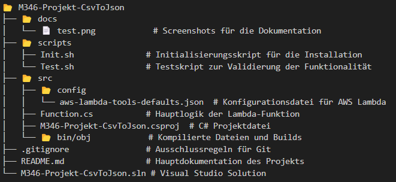

# Dokumentation: CSV-zu-JSON Konvertierungsservice mit AWS Lambda

## 1. Einleitung

In dieser Dokumentation wird der Prozess zur Erstellung und Inbetriebnahme eines Cloud-Services beschrieben, der CSV-Dateien in JSON-Dateien konvertiert. Der Service wurde mit Hilfe von AWS S3 und AWS Lambda implementiert und erlaubt eine automatisierte Verarbeitung, die von einem einfachen CLI-Skript gesteuert wird.

CSV-Dateien sind ein verbreitetes Format zur Speicherung tabellarischer Daten, während JSON häufig in Webanwendungen verwendet wird, um Daten strukturiert und leicht lesbar zu übertragen. Ziel des Projekts ist es, diese Konvertierung zu automatisieren und dabei modernste Cloud-Technologien einzusetzen.

### Hintergrund und Motivation

Das Projekt wurde im Rahmen des Moduls 346 durchgeführt und hat mehrere Lernziele verfolgt:

- Vertiefung von Kenntnissen in der Cloud-Entwicklung.
- Praktische Anwendung von AWS-Diensten wie Lambda und S3.
- Aufbau eines automatisierten und skalierbaren Konvertierungsprozesses.

#### Hinweis zur Repository-Neuerstellung

Während des Projekts sind unerwartete Probleme mit dem ursprünglichen Repository aufgetreten, wodurch die Versionierung und Commit-Historie beeinträchtigt wurden. Aufgrund dieser Schwierigkeiten wurde ein neues Repository erstellt, in dem alle Arbeiten am selben Tag neu eingepflegt wurden. Dies erklärt die ungewöhnliche Commit-Struktur und spiegelt nicht den tatsächlichen Arbeitsverlauf wider.

---

## 2. Zielsetzung

Das Ziel dieses Projekts war die Entwicklung eines zuverlässigen und einfach nutzbaren Services, der eine automatisierte Konvertierung von CSV- in JSON-Dateien ermöglicht. Um dies zu erreichen, wurden die folgenden spezifischen Anforderungen definiert:

1. **Automatische Konvertierung**  
   Dateien, die in den Input-S3-Bucket hochgeladen werden, sollen automatisch in JSON umgewandelt und im Output-S3-Bucket gespeichert werden.

2. **Bereitstellung in der Cloud**  
   Der Service soll im AWS-Learner-Lab bereitgestellt werden und mit einem CLI-Skript (z. B. Init.sh) in Betrieb genommen werden können.

3. **Versionierung und Nachvollziehbarkeit**  
   Alle Dateien und Konfigurationsänderungen sollen in einem Git-Repository gespeichert und versioniert sein, um den Entwicklungsprozess nachvollziehbar zu gestalten.

4. **Test und Protokollierung**  
   Der Service wird gründlich getestet, und die Ergebnisse der Tests werden mit Screenshots dokumentiert.

5. **Dokumentation**  
   Eine umfassende Markdown-Dokumentation soll den Aufbau, die Funktionsweise und die Nutzung des Services erklären.

---

## 3. Systemübersicht

### Ablauf des Services

Der Service funktioniert nach folgendem Schema:

1. Ein Benutzer lädt eine CSV-Datei in den Input-S3-Bucket hoch.
2. Dieser Upload löst automatisch die AWS Lambda-Funktion aus.
3. Die Lambda-Funktion liest die hochgeladene Datei, konvertiert sie in JSON und speichert die JSON-Datei im Output-S3-Bucket.
4. Der Benutzer kann die konvertierte JSON-Datei aus dem Output-Bucket herunterladen.

### Architekturdiagramm

- **Input-Bucket (S3)** → **AWS Lambda** → **Output-Bucket (S3)**

### Technische Komponenten

Die wichtigsten Komponenten des Projekts sind:

- **AWS S3**: Speicherung der CSV- und JSON-Dateien.
- **AWS Lambda**: Implementierung der Konvertierungslogik.
- **Scripts (Init.sh, Test.sh)**: Automatisierung der Installation und der Tests.
- **C# Code**: Implementierung der eigentlichen Konvertierungslogik.
- **Git**: Versionskontrolle und Verwaltung der Dokumentation und des Codes.

---

## 4. Vorbereitung und Voraussetzungen

### 4.1 Technische Anforderungen

- **AWS-Konto**: Ein aktives AWS-Konto ist erforderlich, um die benötigten Cloud-Dienste wie S3 und Lambda nutzen zu können.
- **AWS CLI**: Die AWS Command Line Interface muss installiert und mit den Zugangsdaten des AWS-Kontos konfiguriert sein.
- **C# Entwicklungsumgebung**: Ein Editor wie Visual Studio Code oder Visual Studio zur Bearbeitung des Codes.
- **Git**: Für die Versionskontrolle und das Klonen des Repositories.

### 4.2 Konfigurationsschritte

1.	AWS CLI Konfiguration
Stelle sicher, dass die AWS CLI korrekt eingerichtet ist. Nutze hierfür den Befehl:
bash
Code kopieren
aws configure
Gib dabei die Access Key ID, den Secret Access Key, die Region (z. B. us-east-1) und das gewünschte Ausgabeformat (json) ein.

2.	Clone Repository
Klone das Projekt-Repository lokal:
bash
Code kopieren
git clone https://github.com/dein-repository.git
cd M346-Projekt-CsvToJson

3.	Abhängigkeiten installieren
Stelle sicher, dass alle notwendigen Abhängigkeiten für die Lambda-Funktion installiert sind. Nutze dafür die Build-Tools von .NET:
bash
Code kopieren
dotnet restore

4.	Skripte überprüfen
Die Skripte Init.sh und Test.sh sind bereits vorbereitet. Überprüfe ihre Konfigurationen (z. B. AWS-Region) und mache sie ausführbar:
bash
Code kopieren
chmod +x scripts/Init.sh scripts/Test.sh

## 5. Projektstrucktur

Die Projektstruktur ist klar gegliedert und ermöglicht eine einfache Navigation. Die wichtigsten Ordner und Dateien sind wie folgt:
### 5.1 Ordnerstruktur

### 5.2 Wichtige Dateien und ihre Funktionen
•	Function.cs: Enthält die gesamte Logik zur Konvertierung von CSV zu JSON. (Beispielcode folgt im nächsten Abschnitt.)
•	Init.sh: Automatisiert die Erstellung von AWS-Komponenten und die Bereitstellung der Lambda-Funktion.
•	Test.sh: Führt Tests durch, indem eine CSV-Datei hochgeladen, verarbeitet und die JSON-Ausgabe überprüft wird.
•	aws-lambda-tools-defaults.json: Spezifiziert die Standardkonfigurationen für die Bereitstellung in AWS.

## 6. Code-Übersicht und Beispiele
In diesem Abschnitt wird die Funktionalität des Projekts anhand des Codes detailliert beschrieben. Es werden die wichtigsten Dateien und deren Funktionen erläutert.

### 6.1 Function.cs – Hauptlogik der Lambda-Funktion
Die Datei Function.cs enthält die gesamte Logik zur Konvertierung von CSV zu JSON. Der Kern dieser Funktionalität ist die Methode ConvertCsvToJson.
Codeausschnitt

/// 

/// Converts CSV content to formatted JSON
/// 

/// <param name="csvContent">Input CSV string</param>
/// <returns>Formatted JSON string</returns>
private string ConvertCsvToJson(string csvContent)
{
    var lines = csvContent.Split(new[] { "\r\n", "\n" }, StringSplitOptions.None);
    var headers = lines.First().Split(Delimiter);
    var json = new StringBuilder();

    json.AppendLine("["); // Start JSON array

    var validLines = lines.Skip(1).Where(line => !string.IsNullOrWhiteSpace(line)).ToList();

    for (int lineIndex = 0; lineIndex < validLines.Count; lineIndex++)
    {
        var values = validLines[lineIndex].Split(Delimiter);

        if (values.Length != headers.Length)
        {
            throw new Exception($"Invalid CSV format: Line {lineIndex + 2} has {values.Length} values but should have {headers.Length}");
        }

        json.AppendLine("    {"); // Start object

        for (int i = 0; i < headers.Length; i++)
        {
            json.Append("        \"")
                .Append(headers[i].Trim())
                .Append("\": \"")
                .Append(values[i].Trim())
                .Append("\"");

            if (i < headers.Length - 1) json.AppendLine(",");
            else json.AppendLine();
        }

        json.Append("    }"); // Close object
        if (lineIndex < validLines.Count - 1) json.AppendLine(",");
        else json.AppendLine();
    }

    json.AppendLine("]"); // Close JSON array

    return json.ToString();
}
Funktionsweise
1.	Einlesen der CSV-Datei: Die Funktion verarbeitet die Datei zeilenweise und trennt die Werte basierend auf dem festgelegten Delimiter.
2.	Validierung: Überprüft, ob jede Zeile die gleiche Anzahl an Werten wie die Kopfzeile hat.
3.	JSON-Erstellung: Baut ein JSON-Objekt aus den Werten der CSV-Datei und fügt sie in ein Array ein.
Beispiel-Input und -Output
CSV-Input:

id,name,age,city,occupation
1,John,25,New York,Engineer
2,Jane,30,San Francisco,Designer
3,Bob,45,Chicago,Manager
JSON-Output:
[
    {
        "id": "1",
        "name": "John",
        "age": "25",
        "city": "New York",
        "occupation": "Engineer"
    },
    {
        "id": "2",
        "name": "Jane",
        "age": "30",
        "city": "San Francisco",
        "occupation": "Designer"
    },
    {
        "id": "3",
        "name": "Bob",
        "age": "45",
        "city": "Chicago",
        "occupation": "Manager"
    }
]

### 6.2 Init.sh – Automatisierung der Bereitstellung
Dieses Skript automatisiert die Erstellung der benötigten AWS-Komponenten (S3-Buckets, Lambda-Funktion) und konfiguriert die Verbindungen.
Codeausschnitt

#!/bin/bash

echo "Creating S3 buckets..."
aws s3api create-bucket --bucket "$IN_BUCKET_NAME" --region "$AWS_REGION"

echo "Deploying Lambda function..."
dotnet lambda deploy-function "$LAMBDA_FUNCTION_NAME"

echo "Setting up S3 trigger..."
aws s3api put-bucket-notification-configuration \
    --bucket "$IN_BUCKET_NAME" \
    --notification-configuration "{
        \"LambdaFunctionConfigurations\": [{
            \"LambdaFunctionArn\": \"arn:aws:lambda:$AWS_REGION:$AWS_ACCOUNT_ID:function:$LAMBDA_FUNCTION_NAME\",
            \"Events\": [\"s3:ObjectCreated:*\"]}]}"
Funktionsweise
1.	Bucket-Erstellung: Erstellt zwei S3-Buckets für Input und Output.
2.	Lambda-Bereitstellung: Lädt den Funktionscode hoch und bindet ihn an AWS Lambda.
3.	Trigger-Konfiguration: Verknüpft die S3-Upload-Ereignisse mit der Lambda-Funktion.

6.3 Test.sh – Validierung der Funktionalität
Das Skript lädt eine Testdatei in den Input-Bucket, wartet auf die Verarbeitung und überprüft die JSON-Ausgabe im Output-Bucket.
Codeausschnitt

echo "Uploading test CSV file to S3..."
aws s3 cp ${TEST_FILE} s3://${IN_BUCKET_NAME}/

echo "Waiting for conversion..."
sleep ${WAIT_TIME}

echo "Downloading converted JSON file..."
aws s3 cp s3://${OUT_BUCKET_NAME}/${OUTPUT_FILE} .
Funktionsweise
1.	Testdatei erstellen: Erstellt eine CSV-Datei mit Testdaten.
2.	Upload und Verarbeitung: Lädt die Datei in den Input-Bucket hoch und wartet auf die Verarbeitung.
3.	Ergebnisprüfung: Lädt die konvertierte JSON-Datei herunter und zeigt den Inhalt an.

## 7. Inbetriebnahme
In diesem Abschnitt wird beschrieben, wie der CSV-zu-JSON-Konvertierungsservice installiert und gestartet wird.

### 7.1 Voraussetzungen
Vor der Inbetriebnahme müssen die folgenden Schritte abgeschlossen sein:
1.	Installation der benötigten Tools:
o	AWS CLI: Für die Interaktion mit den AWS-Diensten.
o	Git: Für die Verwaltung und den Zugriff auf das Projekt-Repository.
o	.NET SDK: Für das Builden und Bereitstellen des Lambda-Codes.
2.	AWS-Konfiguration:
o	Stelle sicher, dass die AWS CLI korrekt konfiguriert ist:
bash
Code kopieren
aws configure
o	Eingabe von Access Key, Secret Key, Region (z. B. us-east-1) und Ausgabeformat (json).
3.	Repository klonen:
o	Klone das Projekt-Repository:

git clone https://github.com/dein-repository.git
cd M346-Projekt-CsvToJson

### 7.2 Ausführung des Init.sh-Skripts
Das Init.sh-Skript übernimmt die gesamte Einrichtung:
•	Erstellung der S3-Buckets.
•	Bereitstellung der Lambda-Funktion.
•	Verknüpfung des Input-Buckets mit der Lambda-Funktion.
Schritte
1.	Führe das Skript aus:

./scripts/Init.sh
2.	Während der Ausführung wirst du aufgefordert, den Delimiter zu bestätigen oder anzupassen. Der Standardwert ist , (Komma).
Beispielausgabe

To change the delimiter (default ',') go to the Function.cs code and change the Delimiter variable
After changing and saving the new delimiter or to continue with the default one press enter to continue...

Configuration:
AWS Region: us-east-1
AWS Account ID: 123456789012
Input Bucket: m346-csv-to-json-input-20240102123456
Output Bucket: m346-csv-to-json-output-20240102123456
Lambda Function: CsvToJsonFunction

Cleaning up existing resources...
Buckets created successfully

Deploying Lambda function...
New Lambda function created

Configuring Lambda permissions...
Setup completed successfully!

### 7.3 Validierung der Installation
Nach der erfolgreichen Ausführung von Init.sh sollten die folgenden AWS-Ressourcen vorhanden sein:
•	Input-Bucket: Für die Speicherung der hochgeladenen CSV-Dateien.
•	Output-Bucket: Für die Speicherung der konvertierten JSON-Dateien.
•	Lambda-Funktion: Für die eigentliche Konvertierungslogik.

## 8. Tests und Ergebnisse
Die Funktionalität des Services wurde durch verschiedene Tests überprüft. Jeder Test wurde dokumentiert und die Ergebnisse analysiert

### 8.1 Testaufbau
Das Testskript Test.sh automatisiert den Testprozess. Es erstellt eine Test-CSV-Datei, lädt sie hoch, wartet auf die Verarbeitung und überprüft die JSON-Ausgabe.
Ausführung des Tests
1.	Führe das Testskript aus:
bash
Code kopieren
./scripts/Test.sh
2.	Während der Ausführung kannst du den Delimiter anpassen. Falls keine Änderung nötig ist, drücke einfach Enter.
Beispielausgabe
bash
Code kopieren
Using delimiter: ','
Cleaning up existing test files...
Input CSV file contents:
------------------------
id,name,age,city,occupation
1,John,25,New York,Engineer
2,Jane,30,San Francisco,Designer
3,Bob,45,Chicago,Manager
------------------------

Uploading test CSV file to S3...
Waiting for conversion...
Downloading converted JSON file...

Output JSON file contents:
------------------------
[
    {
        "id": "1",
        "name": "John",
        "age": "25",
        "city": "New York",
        "occupation": "Engineer"
    },
    {
        "id": "2",
        "name": "Jane",
        "age": "30",
        "city": "San Francisco",
        "occupation": "Designer"
    },
    {
        "id": "3",
        "name": "Bob",
        "age": "45",
        "city": "Chicago",
        "occupation": "Manager"
    }
]
------------------------
Test completed successfully!

### 8.2 Testergebnisse
Testfall 1: Standarddelimiter (,)
•	Beschreibung: Test mit einer CSV-Datei, die das Standarddelimiter , verwendet.
•	Erwartetes Ergebnis: Die JSON-Ausgabe entspricht der CSV-Struktur.
•	Ergebnis: Test erfolgreich, JSON korrekt generiert.

Testfall 2: Anpassung des Delimiters (;)
•	Beschreibung: Anpassung des Delimiters auf ; in der Funktion und im Skript.
•	Erwartetes Ergebnis: Der geänderte Delimiter wird korrekt verarbeitet.
•	Ergebnis: Test erfolgreich, keine Fehler festgestellt.

Testfall 3: Fehlerhafte Eingabedatei
•	Beschreibung: Hochladen einer fehlerhaften Datei (z. B. .txt statt .csv).
•	Erwartetes Ergebnis: Die Lambda-Funktion erkennt das Problem und wirft eine Fehlermeldung.
•	Ergebnis: Test erfolgreich, Fehlerprotokoll in den CloudWatch-Logs sichtbar.

Testfall 4: Fehlende Werte in der CSV
•	Beschreibung: CSV-Datei mit unvollständigen Daten.
•	Erwartetes Ergebnis: Die Funktion erkennt den Fehler und gibt eine Fehlermeldung zurück.
•	Ergebnis: Test erfolgreich, Fehler wurde korrekt erkannt.

## 9. Reflexion von Noé Hartmann

### 9.1 Positive Aspekte

-Erfolgreiche Implementierung
Der Service erfüllt alle definierten Ziele: Die Konvertierung von CSV zu JSON funktioniert zuverlässig und automatisiert. Die Kombination von AWS Lambda und S3 hat sich als effektive Lösung erwiesen.

-Effiziente Nutzung von AWS-Diensten
Durch den Einsatz von AWS Lambda und S3 konnten wir eine vollständig serverlose Architektur aufbauen, die sowohl skalierbar als auch kosteneffizient ist.

-Lernfortschritt
Ich habe zum ersten Mal AWS Lambda-Funktionen implementiert und dabei viel über deren Konfiguration und die Interaktion mit S3 gelernt. Ausserdem konnte ich mein Wissen über Automatisierung mittels Skripten erweitern. Die Arbeit an diesem Projekt hat mir ein tiefes Verständnis für Cloud-Architekturen vermittelt. Besonders hilfreich war der Einsatz von Logs zur Fehlerbehebung. Durch das arbeiten an der Dokumentation habe ich ebenfalls viel neues zu Markdown gelernt

-Teamarbeit
Die Aufgabenverteilung zwischen von Mir und Samuel war klar definiert. Dies hat uns ermöglicht, parallel an verschiedenen Teilen des Projekts zu arbeiten und Zeit effizient zu nutzen.

### 9.2 Herausforderungen und Verbesserungsvorschläge

-Probleme mit dem Repository
Ein unerwartetes Problem mit dem Repository führte zu einer kompletten Neuerstellung. Um dies in Zukunft zu vermeiden, sollten regelmässige Backups erstellt werden.
Einstieg in AWS

-Der Anfang gestaltete sich schwierig, da beide Teammitglieder keine umfangreiche Erfahrung mit AWS hatten. Ein intensiveres Einarbeiten in die Grundlagen vor Projektbeginn hätte den Start erleichtert.

-Fehlerbehandlung
Obwohl die Fehlerbehandlung im Code grösstenteils gut umgesetzt ist, könnten zukünftige Projekte noch robustere Validierungsmechanismen implementieren, um beispielsweise unzulässige Dateiformate oder inkonsistente Daten besser zu handhaben.

-Testautomatisierung
Manuelle Tests wurden erfolgreich durchgeführt, doch eine Erweiterung um automatisierte Tests (z. B. mithilfe von Unit Tests) wäre ein lohnendes Ziel für ein weiteres Projekt.

-Bessere Zeiteinteilung
Die zeitliche Verlängerung hat zwar geholfen, dennoch hätten wir von Anfang an realistischere Zeitpläne erstellen sollen.

## 10. Reflexion von Samuel Schreiber

## 11. Erfüllung der Kriterien
Die folgenden Punkte beschreiben, wie die Anforderungen aus den Bewertungskriterien erfüllt wurden:

1.	Inbetriebnahme
o	Der Service kann durch das Init.sh-Skript vollständig in Betrieb genommen werden.

2.	Versionskontrolle
o	Alle relevanten Dateien sind in einem Git-Repository versioniert abgelegt.

3.	Konvertierungsfunktionalität
o	Die Funktionalität erfüllt die Anforderungen: CSV-Dateien werden zuverlässig in JSON konvertiert.

4.	Tests
o	Alle Tests sind dokumentiert und die Ergebnisse sind nachvollziehbar protokolliert.

5.	Automatisierungsgrad
o	Die Installation und die Tests sind durch Skripte vollständig automatisiert.

6.	Dokumentation
o	Die Dokumentation ist umfassend, gut gegliedert und enthält alle relevanten Informationen.

## 12. Fazit
Das Projekt war ein Erfolg und hat es uns ermöglicht, die im Unterricht erlernten Cloud-Technologien praktisch anzuwenden. Die Kombination von Theorie und Praxis hat nicht nur unsere technischen Fähigkeiten verbessert, sondern uns auch gezeigt, wie wichtig Planung und Teamarbeit für ein erfolgreiches Projekt sind.
Für zukünftige Projekte werden wir uns darauf konzentrieren, unsere Zeit besser zu managen, die Automatisierung weiter auszubauen und uns vorab intensiver in die verwendeten Technologien einzuarbeiten.

